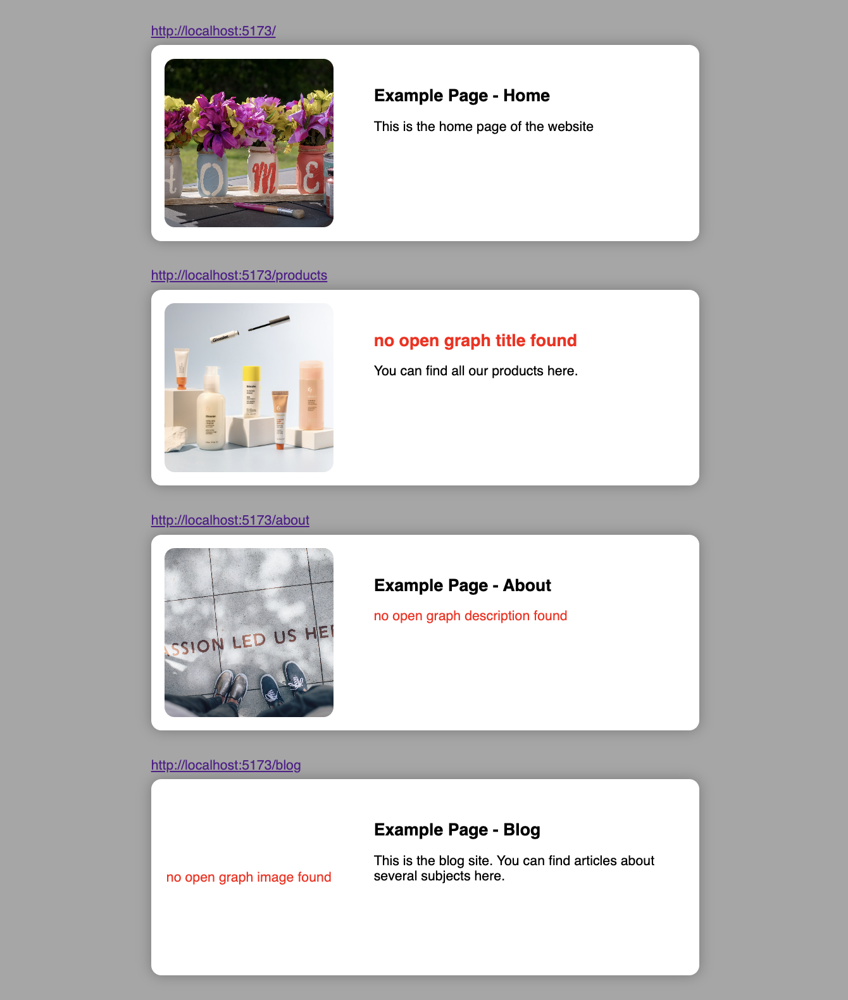

# og-preview

**Please note: Package is still in development process. If you encounter any issues, please report them as described in the [Report Issues](#report-issues) section.**

`og-preview` is a CLI tool to preview all available Open Graph meta data from the local development server. This allows you to check how the links of your website will appear on social media platforms without deploying your project or checking every URL manually. You simply need to execute a single CLI command.

## Installation

### Local Installation

To install `og-preview` locally, run the following command in your projects root directory:

```sh
npm install og-preview
```

### Global Installation

To install `og-preview` globally, run the following command:

```sh
npm install -g og-preview
```

You can then use the package for all projects you are working on.

## Usage

Ensure your project is running on your local development server and is open in the browser. For example, if your project is running at http://localhost:5173, you can use og-preview to view the Open Graph meta data of the project running on that port.

This way you can easily check if the links of your website will appear as expected when shared on social media.

Restart the og-preview server after you made changes to any meta data in your project.

## Command

**Note:** When installed locally, you need to add `npx` in the beginning of the command.

Replace `PORT` with the port number that your local development server is running on.

If your project **is** a Single Page Application, you must set the flag <nobr>`--spa`</nobr>.<br>
If your project **is not** a Single Page Application, you must set the flag <nobr>`--nospa`</nobr>.

#### Locally installed:

```sh
npx og-preview start -p PORT --spa
```

```sh
npx og-preview start -p PORT --nospa
```

#### Globally installed:

```sh
 og-preview start -p PORT --spa
```

```sh
 og-preview start -p PORT --nospa
```

## Example

If your project is running on port 5173 and **is SPA**, use the following command:

```sh
og-preview start -p 5173 --spa
```

If your project is running on port 5173 and **is not SPA**, use the following command:

```sh
og-preview start -p 5173 --nospa
```

This will generate a preview of how the links of your website will appear when shared on social media platforms.

## Features

- **Easy to Use:** Simple CLI command to get a preview of all available Open Graph meta data.
- **Local Development:** Works with your local development server, no need to deploy.
- **Quick Preview:** Instantly opens a new browser tab with the Open Graph preview.

## Example Workflow

1. Start your local development server: Ensure your project is running locally and is open in the browser, e.g. http://localhost:5173.

2. Run og-preview: Execute the following command in your CLI:

#### Package Installed locally:

```sh
npx og-preview start -p 5173 --spa
```

#### Package Installed globally:

```sh
og-preview start -p 5173 --spa
```

## Usage without installation

You can also generate a preview without installing the package. The workflow is exact the same as for the local installation. <br>
Just keep in mind that the execution time will be longer and therefore this practice is more convienent for testing the package or getting an one-off preview.

A new browser tab will automatically open, displaying the Open Graph meta data for your project:



## Report Issues

Please help me to improve this package.
If you encounter any bugs or issues, please report them by following these steps:

1. **Search Existing Issues**: Before submitting a new issue, please check if it has already been reported in the [Issues section](https://github.com/marcorosenbaum/og-preview/issues).
2. **Open a New Issue**: If the issue is not already reported, open a new issue by clicking on the "New Issue" button.
3. **Provide Details**: Include as much detail as possible in your report. This should include:
   - A descriptive title
   - Steps to reproduce the issue
   - Expected behavior
   - Actual behavior
   - Screenshots or logs (if applicable)
   - Environment details (e.g., OS, Node.js version, npm version)

**Thank you for your help!**
